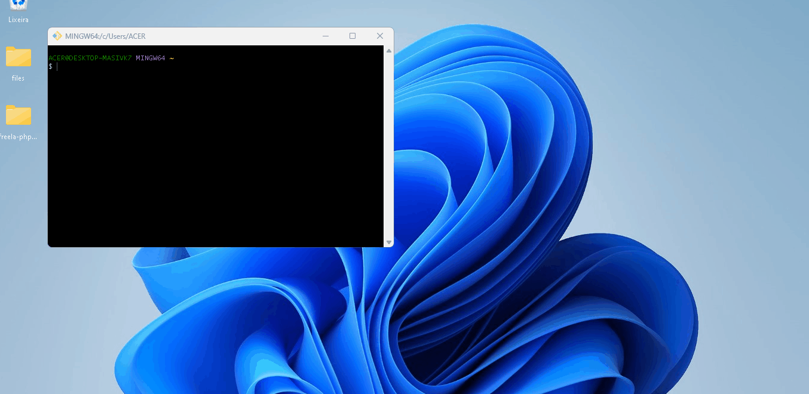
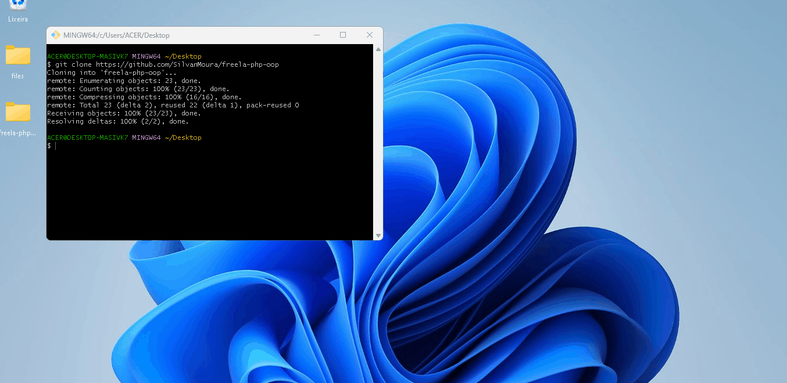

# Executando

## Pré-requisitos
Se você ainda não possui um ambiente local com PHP e GIT, se preferir, use os seguintes links:

 - PHP: https://kinsta.com/pt/blog/instalar-php/
 - GIT: https://www.hostinger.com.br/tutoriais/tutorial-do-git-basics-introducao#1o_Passo_-_Instalar_o_GIT_em_Sistemas_Diferentes

Verifique se está instalado corretamente executando os seguintes comandos em seu terminal:

 

    
    php -v
    

 
 

    git -v    

 
 
 

## php-oop

    
Clonando o Repositório

Abra o terminal do git, de preferência em sua área de trabalho, e execute o comando

    git clone https://github.com/SilvanMoura/freela-php-oop

 

    
Entrando no repositório clonado

    cd freela-php-oop

 

    
Executando

    php public/index.php

